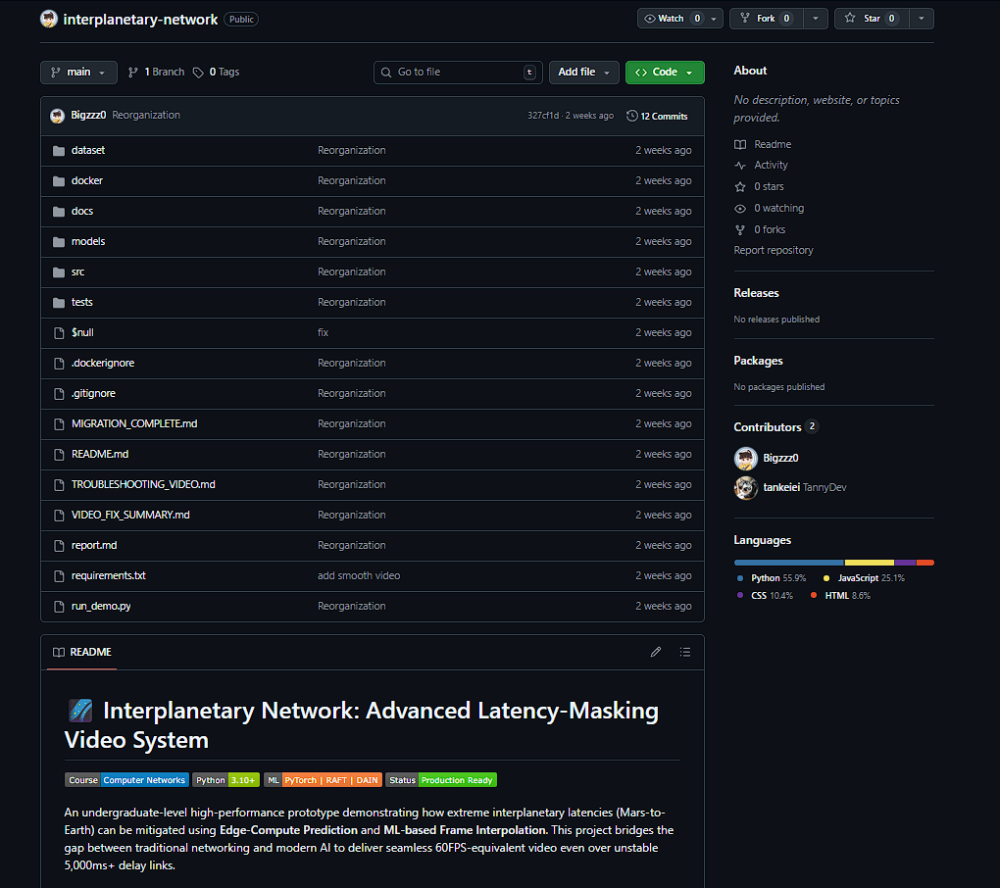
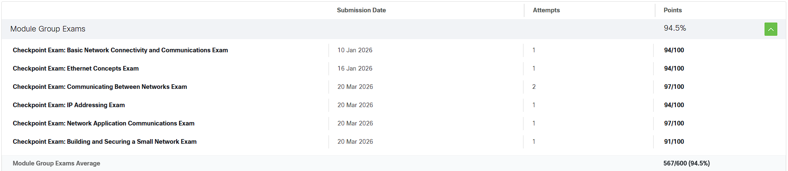
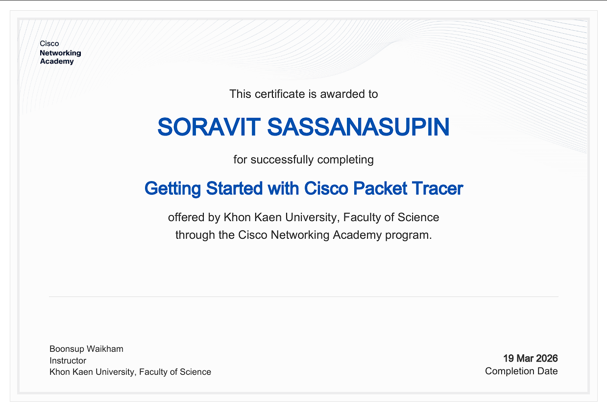
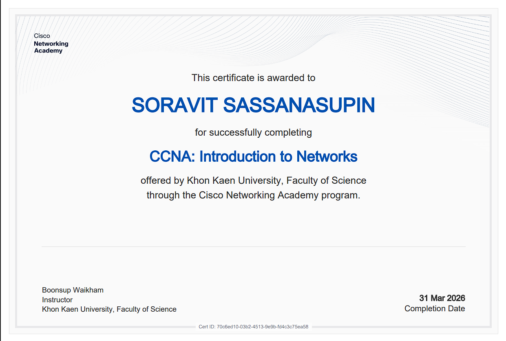

# Network-Portfolio
นายสรวิชญ์ ศาสนสุพินธุ์ 673380294-1 SC-CS Section 01

Email : soravit.sa@kkumail.com

---

## 📄 Assignments

| Assignment | Document Link | PDF File |
|---------------|---------------|-------|
| Essay Link | [Personal Essay](https://docs.google.com/document/d/11nvoxZxldWSgnHfbTxsRpUyj4XV8Y6dmi0By8083TUE/edit?usp=sharing) | [Personal Essay PDF](./Assignments/Personal_essay.pdf) |
| Examine Sample Topology | [Examine Sample Topology](https://docs.google.com/document/d/1CIsmjcqvHMJblH4d3Tpu_JvOie9R7-6wzlpcmTx-fC8/edit?usp=sharing) | [Examine Sample Topology PDF](./Assignments/Assignment2.pdf) |
| Build a Not-Simple Network | [Build a Not-Simple Network](https://docs.google.com/document/d/1dqsD_pvxm_G1FJOx1Vxh3tY7KQm-5BC2hOYYm2xG5w4/edit?usp=sharing) | [Build a Not-Simple Network PDF](./Assignments/Assignment3.pdf) |
| TCP and UDP Communications | [TCP and UDP Communications](https://docs.google.com/document/d/1Kc0obT6hEGcb2ab0LTxqPhneaMdNRLPkS2C8xg-rR-s/edit?usp=sharing) | [TCP and UDP Communications PDF](./Assignments/Assignment4.pdf) |
| Design a New Network | [The Planetory Laser-Link](https://docs.google.com/document/d/1y_WAwktwegxmxNc5L3kbcAw48hG6ms6k0Fxvzm_GM3s/edit?usp=sharing) | [Laser-Link-PDF](./Assignments/The-Planetory-Laser-Link_%20Multi-Sensory-Deep-Space-Network.pdf) |

---

## 🧪 Labs

| Lab | Lab Procedure | Document Link | PDF File |
|-------------|----|--------------|--------------|
| Complete Lab-Focused Teaching Package | [Lab1](https://docs.google.com/document/d/1XFq11XGvdNimYOuGCBhVNhWAjTyOamliVIgl9qgmmwg/edit?usp=sharing) | [Lab 1 Report](https://docs.google.com/document/d/1oqGtlcZ23RfcoAmh7J8UIyy4ez55hrun_UrntW8NqAg/edit?usp=sharing) | [Lab 1 Report PDF](./Labs/Lab1_Report.pdf) |
| Secure & Scalable VLAN Design | [Lab2](https://docs.google.com/document/d/13DxRvjRThcw4TzmzoeLVVkpoOd0eZD_AoW6PQYW4w80/edit?usp=sharing) | [Lab 2 Report](https://docs.google.com/document/d/1bFA9APAwBCsOpFJhOlSNbxDys74AXxjFP4qOcadhXrc/edit?usp=sharing) | [Lab 2 Report PDF](./Labs/Lab2_Secure&Scalable_VLAN_Design.pdf) |
| MIME File Transfer over Router-on-a-Stick with Wireshark Analysis | [Lab3](https://docs.google.com/document/d/1G2408W1rx3kw_MaGTgfoBxl-n-9P3Tf82HkJ4-Y8Uzk/edit?usp=sharing) | [Lab 3 Report](https://docs.google.com/document/d/1f4ruHR8qC6pV63fiCZ2uI9psKrLqej3c8NhWxdt11gA/edit?usp=sharing) | [Lab 3 Report PDF](./Labs/Lab3.pdf) |
| Simulated Internet (10.10.0.0/16) & Private LANs with Stateful vs Stateless Services | [Lab4](https://docs.google.com/document/d/1e5geAwvcc91tYcskedPVItduVT4X8mVJPXNi5Iodvzs/edit?usp=sharing) | [Lab 4 Report](https://docs.google.com/document/d/1IFeSFYEjTHPoRWvstWsnvtbRHp8uLUmtbv5R79g6G7k/edit?usp=sharing) | [Lab 4 Report PDF](./Labs/Lab4.pdf) |
| Internet Edge + ISP Serial WAN + Week03 Microservices | [Lab5](https://docs.google.com/document/d/1O7xv3HAbBysWbEZ3gU6G_mfThbHDtcoiJ3Fs6habJak/edit?usp=sharing) | [Lab 5 Report](https://docs.google.com/document/d/1T2g5_kXfkkB9ZJMbY8B4TMwRGiB3Di5354XPloe6H54/edit?usp=sharing) | [Lab 5 Report PDF](./Labs/Lab5.pdf) |

---

## 🚀 Final Project

**Interplanetary Network**

Project repository:  
https://github.com/Bigzzz0/interplanetary-network.git

---

## 📝 Checkpoint Exam

These are the scores from all the Checkpoint Exams taken at the Cisco Networking Academy.

---

## 📜 Certificate

| Course | Source | PDF File |
|-----------|---------------|----------|
| Pre1 Computer Networks – Getting Started with Cisco Packet Tracer | Cisco | [Certificate](./Certification/Getting_Started_with_Cisco_Packet_Tracer_certificate_soravit-sa-kkumail-com_2073d450-cd8a-46e9-a1f7-79a77eb44846.pdf) |
| CCNA: Introduction to Networks | Cisco | [Certificate](./Certification/CCNA-_Introduction_to_Networks_certificate_soravit-sa-kkumail-com_70c6ed10-03b2-4513-9e9b-fd4c3c75ea58.pdf)

**From : Pre1 Computer Networks – Getting Started with Cisco Packet Tracer**

**From : CCNA: Introduction to Networks**

---